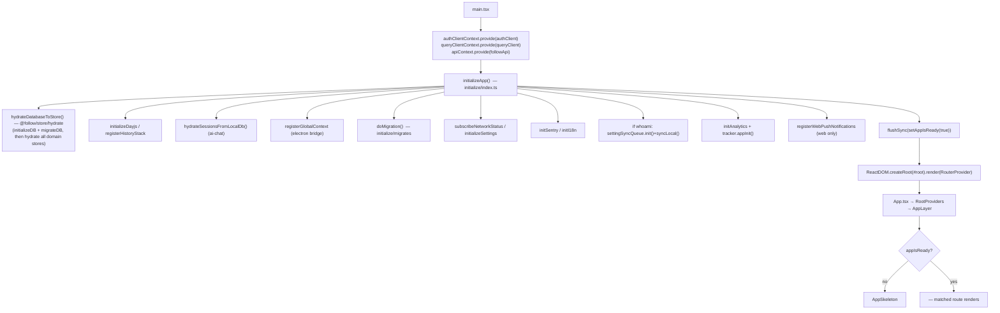
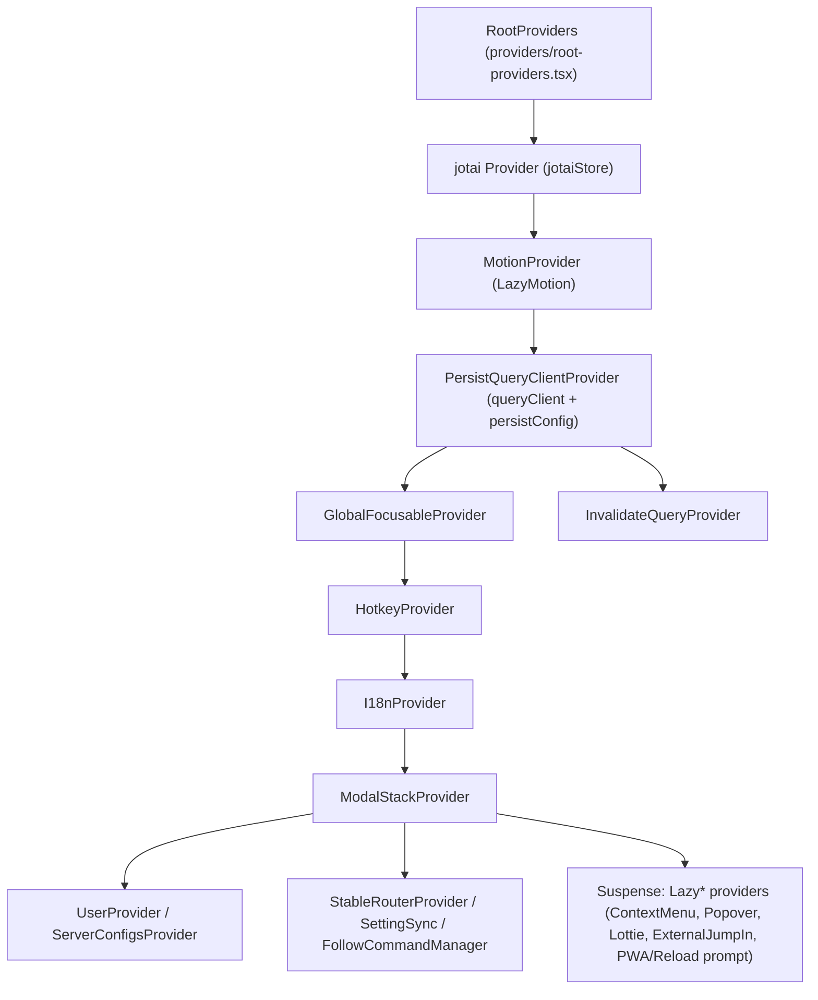
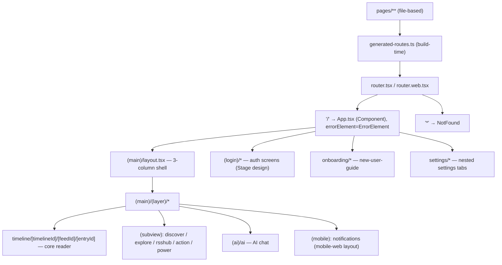
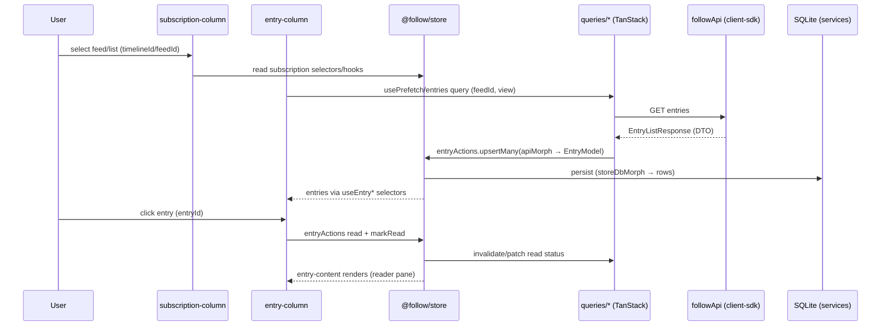
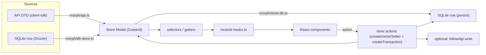
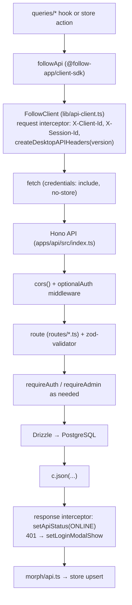
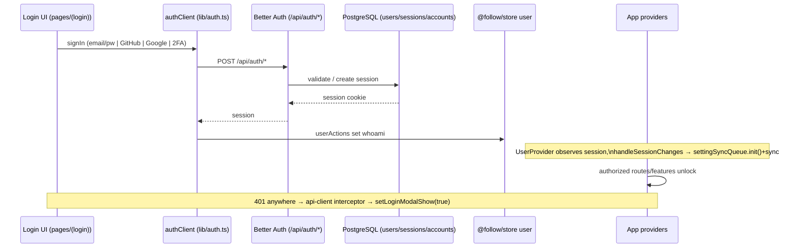
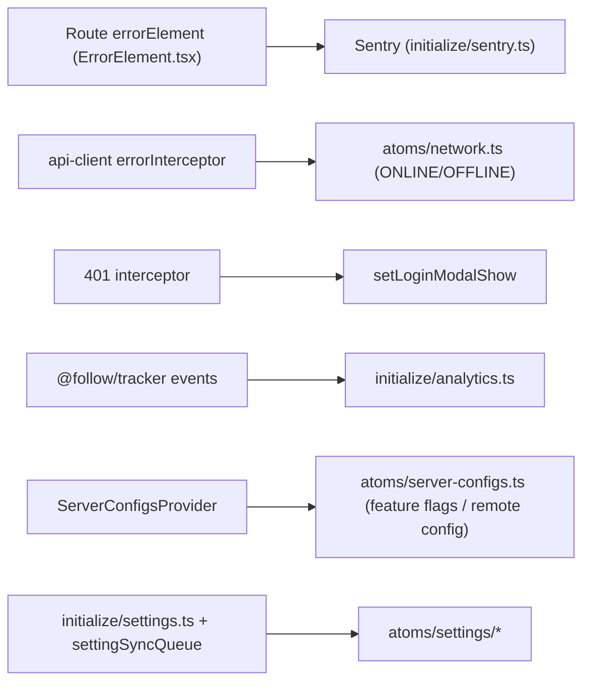

# Application & Technical Flows

> Phase 1 analysis. Diagrams describe the **desktop/web renderer** unless noted. File paths are relative to the repo root; renderer paths are shortened from `apps/desktop/layer/renderer/src/`.

## 1. Application startup flow

Entry: `main.tsx` provides the three JS contexts (`api`, `auth`, `queryClient`) **before** anything consumes them, then runs `initializeApp()` and renders the router. `App.tsx` gates rendering behind an `appIsReady` atom and shows a skeleton until then.

- **Files:** `main.tsx`, `initialize/index.ts`, `initialize/{settings,analytics,sentry,history,migrates,queue}.ts`, `App.tsx`, `providers/root-providers.tsx`.
- **Key functions:** `initializeApp`, `hydrateDatabaseToStore`, `setAppIsReady`, `applyAfterReadyCallbacks`.
- **Key state:** `appIsReady` atom (`atoms/app.ts`); domain stores hydrated from SQLite.
- **Contexts:** `apiContext`, `authClientContext`, `queryClientContext` (`@follow/store/context`) — a hand-rolled JS singleton context, **not** React context, so non-React store code can reach the API/query client.

## 2. Provider composition

- Server-cache persistence is wired here (`PersistQueryClientProvider`), which is why TanStack Query survives reloads.

## 3. Routing & navigation flow

File-based routing: `vite-plugin-route-builder` scans `pages/` and emits `generated-routes.ts`. `router.tsx` chooses `createHashRouter` (Electron / debug-proxy) or `createBrowserRouter` (web), optionally Sentry-wrapped.

- **Timeline params:** `timelineId` (view/feed source) → `feedId` (subscription) → `entryId` (article). This nested triple is the app's primary navigation axis.
- **Key files:** `router.tsx`, `pages/(main)/layout.tsx`, `pages/(main)/(layer)/timeline/...`, `components/common/{ErrorElement,NotFound}.tsx`.

## 4. Core business flow — reading an entry (feed → list → reader)

- **Files:** `modules/subscription-column/*`, `modules/entry-column/*`, `modules/entry-content/*`, `queries/entries.ts`, `packages/internal/store/src/modules/entry/*`, `packages/internal/database/src/services/entry.ts`.
- **Key hooks:** `hooks/biz/useEntryActions.tsx` (555 LOC — read/star/share/AI actions), store `entry/hooks.ts`, `subscription/hooks.ts`.
- **Key state:** `entry` store (`data` map keyed by entryId), `subscription` store, `unread` store, `collection` store (stars).

## 5. State-update flow (the 3-layer morph model)

Every domain store follows the same shape: `store.ts` (Zustand state + actions), `getter.ts`/`selectors.ts` (pure reads), `hooks.ts` (React bindings + query prefetch), `types.ts`, `utils.ts`. Writes fan out to SQLite and to the server; reads come from the store.

- **Files:** `packages/internal/store/src/lib/helper.ts` (`createZustandStore`, `createImmerSetter`, `createTransaction`), `morph/{api,store-db,db-store}.ts`, each `modules/*/store.ts`.
- **Hydration:** on boot, `hydrate.ts` calls each store's `hydrate()` to load SQLite → store (via `db-store` morph).
- **Note:** stores import each other (e.g. `subscription/store.ts` imports `feed`, `inbox`, `list`, `unread`, `user`) — see coupling notes in `docs/refactor-risks.md`.

## 6. API request/response flow (client → server)

- **Client:** `lib/api-client.ts` (interceptors for headers, network status, 401 → login modal). Network status lives in `atoms/network.ts`.
- **Server:** `apps/api/src/index.ts` mounts each router at both `/resource` and `/api/v1/resource`; auth handled at `/api/auth/*` (and legacy `/better-auth/*` rewrite).
- **Validation:** `@hono/zod-validator` per route.

## 7. Authentication & authorization flow

- **Server:** `apps/api/src/auth/index.ts` (Better Auth: emailAndPassword, GitHub, Google, `twoFactor`, `anonymous`, `admin`, Stripe plugin, custom plugins in `auth/plugins.ts`). Email via Resend (`lib/email.ts`).
- **Authorization:** `middleware/auth.ts` — `optionalAuth` (global), `requireAuth`, `requireAdmin`.
- **Client:** `providers/user-provider.tsx`, `atoms/user.ts` (`setLoginModalShow`), `@follow/store` user module (`whoami`), `settingSyncQueue` (post-login settings sync).

## 8. Error handling, analytics, config

- **Errors:** React Router `errorElement` (`ErrorElement.tsx`) + Sentry wrapping the router; API failures surface through interceptors and network atoms.
- **Analytics/telemetry:** `@follow/tracker` (`tracker.appInit`, `tracker.uiRenderInit`, etc.), initialized in `initialize/analytics.ts`.
- **Feature flags / remote config:** `ServerConfigsProvider` + `atoms/server-configs.ts` (server-driven); `atoms/debug-feature.ts` for local toggles.
- **Settings:** `initialize/settings.ts`, `atoms/settings/*`, synced to server via `modules/settings/helper/sync-queue` when authenticated.
