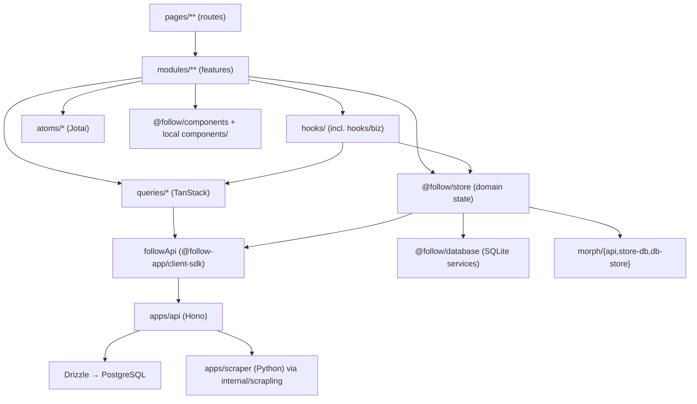
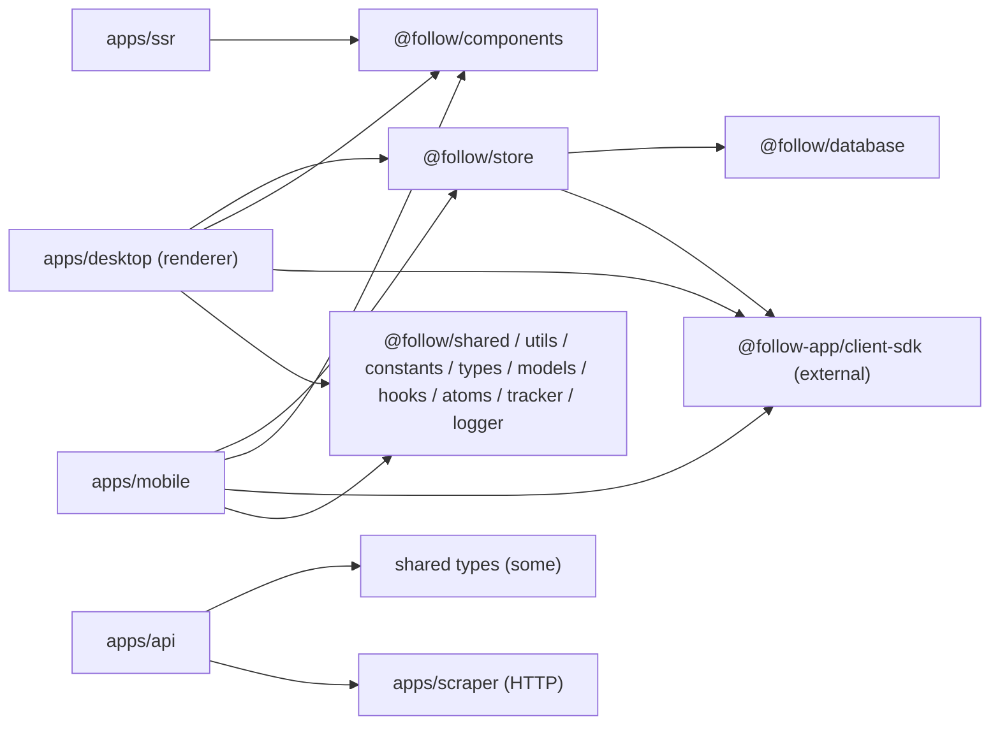
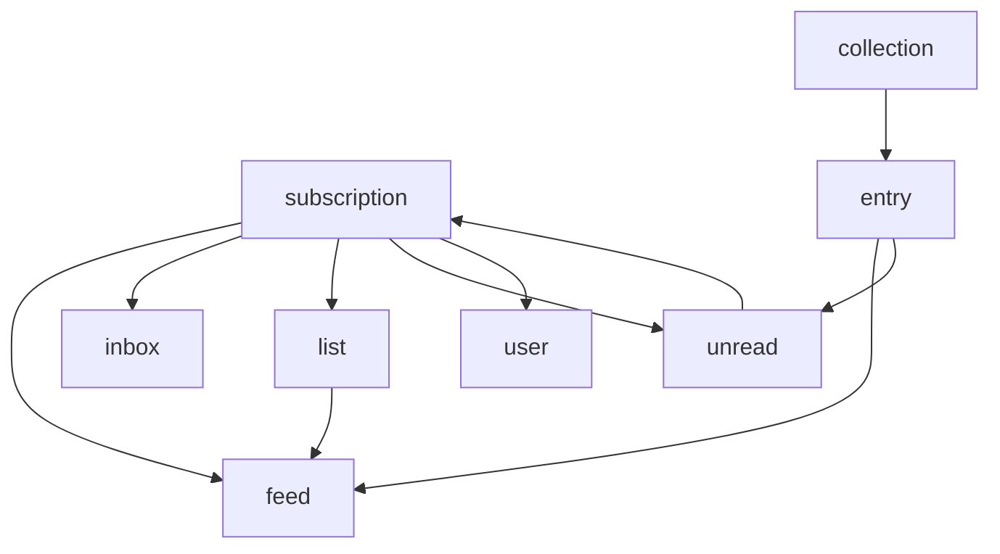
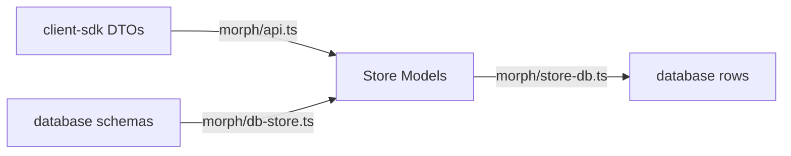

# Module Dependency Map

> Phase 1 analysis. Describes how layers depend on one another and where the coupling concentrates. Renderer paths shortened from `apps/desktop/layer/renderer/src/`.

## 1. Layered architecture (intended direction)

**Intended rule:** dependencies flow downward (pages → modules → hooks/queries/store → sdk/db). UI never talks to the API directly except through `queries/*` or store actions.

## 2. Cross-app dependency graph

- `@follow/store` is the **hub**: both desktop and mobile depend on it, and it depends on `@follow/database` + the client SDK. Changes here have the widest blast radius.
- The API server is decoupled from the clients except through the **published SDK contract** and shared types — a change to a route's response shape ripples through `client-sdk` → `morph/api.ts` → store models → UI.

## 3. Domain store internal coupling

Each store module lives in `packages/internal/store/src/modules/<domain>/` with `store.ts`, `getter.ts`/`selectors.ts`, `hooks.ts`, `types.ts`, `utils.ts`. The store modules **import each other** at the `store.ts` level:

Measured cross-module imports among `modules/*/store.ts` (import counts): `entry` ×7, `feed` ×6, `user` ×4, `subscription` ×4, `list` ×3, `unread` ×2, `inbox` ×1, `collection` ×1.

- `feed`, `entry`, `subscription`, and `user` are the **most depended-upon** store modules — treat them as the store's core.
- `subscription ↔ unread` is a **potential cycle** (subscription imports unread; unread imports subscription). Verify with a dependency-cycle tool before refactoring either (see `docs/refactor-risks.md`).

## 4. The morph layer (translation hub)

- `morph/api.ts` imports types from **both** `@follow/database/schemas/types` and `@follow-app/client-sdk`, and returns every store model type. It is a **fan-in/fan-out chokepoint**: nearly every domain touches it. A field added to a feed/entry/subscription usually requires edits in all three morph files plus the store model type.

## 5. Contexts & singletons (non-obvious edges)

- `@follow/store/context` exposes `api()`, `authClient()`, `queryClient()` as **module-level JS singletons** (not React context), provided once in `main.tsx`. Store code and non-React utilities depend on these being provided before use — an ordering dependency that isn't visible in the import graph.
- `@follow/shared/bridge` (`registerGlobalContext`) couples the renderer to the Electron main process via a global object; web builds stub it.
- `providers/root-providers.tsx` is a **hidden dependency aggregator** — the order of providers there encodes runtime dependencies (jotai → motion → query → focusable → hotkey → i18n → modal → user/config).

## 6. Client ↔ server contract points

| Contract       | Client side                                  | Server side                                                |
| -------------- | -------------------------------------------- | ---------------------------------------------------------- |
| REST resources | `queries/*`, `followApi`                     | `apps/api/src/routes/*` (dual `/x` + `/api/v1/x`)          |
| Auth           | `lib/auth.ts`, `providers/user-provider.tsx` | `apps/api/src/auth/index.ts` + `/api/auth/*`               |
| Data shapes    | `morph/api.ts` + store model types           | Drizzle `schema.ts` → serialized via routes → `client-sdk` |
| Settings sync  | `modules/settings/helper/sync-queue`         | `routes/settings.ts` (`userSettings` table)                |
| Scraping       | (server-only)                                | `routes/internal-scrapling.ts` → `apps/scraper`            |

## 7. Where to look first when changing X

| You want to change…           | Touch these                                                                                                                                                            |
| ----------------------------- | ---------------------------------------------------------------------------------------------------------------------------------------------------------------------- |
| A feed/entry field end-to-end | `apps/api/src/db/schema.ts` → route serializer → `client-sdk` (external) → `morph/api.ts` → `modules/<domain>/{types,store}.ts` → `database/schemas` + `services` → UI |
| The reader/timeline UI        | `modules/entry-column`, `modules/entry-content`, `hooks/biz/useEntryActions.tsx`, store `entry/*`                                                                      |
| Subscription sidebar          | `modules/subscription-column`, store `subscription/*`                                                                                                                  |
| Auth behavior                 | `apps/api/src/auth/*`, `providers/user-provider.tsx`, `atoms/user.ts`, store `user/*`                                                                                  |
| A new route/page              | add file under `pages/**` (regenerates `generated-routes.ts`)                                                                                                          |
| A new API endpoint            | new/extended `apps/api/src/routes/*.ts` + mount in `src/index.ts` (both paths)                                                                                         |
